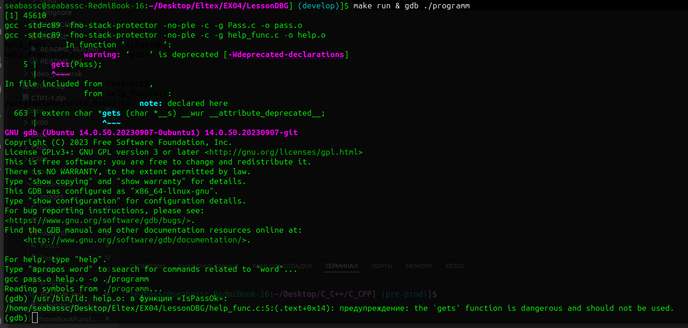

### Компилируем и запускаем программу через GDB
```
make run & gdb ./programm
```


### Устанавливаем брейкпоинт в файле help_func.c:5 на пятой строчке
```
b help_func.c:5
```
### Запускаем выполнение программы и видим, что остановились на 5 строчке в нужной нам функции
- Командой ``` f ``` видим, что стоим в данный момент на 5 строчке


### Переходим командой ``` n ``` на один шаг вперед, вводим любой пароль и видим, необходимый пароль

### Командой ``` p Pass = "test" ``` вводим необходимый пароль, для успешной верификации
- Поменяли значение переменной 


### Командой ``` c ```  продолжаем выполнение программы
- Видим, что проверка пароля прошла успешно


