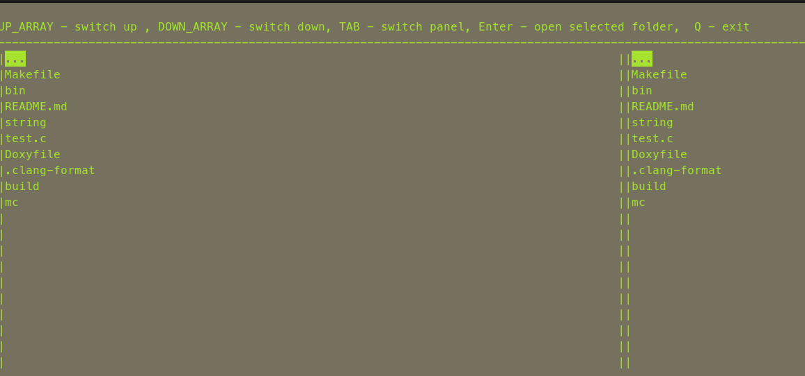

## Для запуска генерации документации необходимо выполнить команду ``` make dvi ```
#### Для генерации необходимо, чтобы у вас была установлена ``` doxygen ```


## Проект << String >>
#### Для запуска компиляции необходимо ввести комаду ``` make string ```

#### Для запуска тестов на учетку памяти, необходимо ввести команду ``` make valgrind-string ```

--- 

## Проект файлового менеджера << MC >> 


#### Для запуска компиляции необходимо ввести команду  ``` make mc ```
> Исходники скомпилирует необходимые бинарники, а из бинарников соберется статическая библиотека, так же соберется динамическая библиотека для управления плагином для цвета

#### Чтобы поменять цвета файлового менеджера необходимо выполнить несколько действий
1) по пути ``` mc/plaguns/ ``` найти текстовый файл ``` colors.txt. ```
2) произвести в нем изменения, ввести необходимое сочетание цветов
> доступные цвета 
- RED - красный
- BLUE - голубой 
- GREEN - зеленый
- YELLOW - желтый
- BLACK - черный
- WHITE -  белый
- CYAN - бирюзовый
> Если файл оставить пустым или ввести не правильно цвета, то цвета применятся стандартные бирюзовые буквы и черный фон
-  правильный синтаксис ввода цвета 0 индекс цвет букв 1 индекс цвет фона
```
RED 0
BLACK 1
```


3) после выполнения условий написанный выше, выполнить команду ``` make color_plugin ```, динамическая библиотека обновится
4) перезапустить ваш файловый менеджер, цвета применятся после перезагрузки

#### Для проверки на утечку памяти, необходимо после сборки проекта ввести команду ``` make valgrind-mc ``` и воспользоваться менеджером, после выхода из менеджера, можно ознакомиться с отчетом об утечках

#### Для компиляции проекта с отладкой, необходимо выполнить команду ``` make debug ``` и через ``` gdb bin/mc ``` запустить менеджер